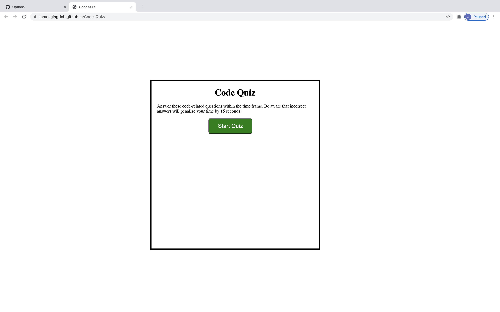

# Code-Quiz
## Introduction
OSU Coding Bootcamp Week 4 I James Gingrich was assinged to create a code quiz with HTML and CSS from scratch and then afterwards enhanced with Javascript that would create an interactive quiz with multiple choice, a timer that is deducted from with wrong answers, and laslty once the quiz is finished a page to log the users high score.

### Link to URL
https://jamesgingrich.github.io/Code-Quiz/
#### Screenshot

